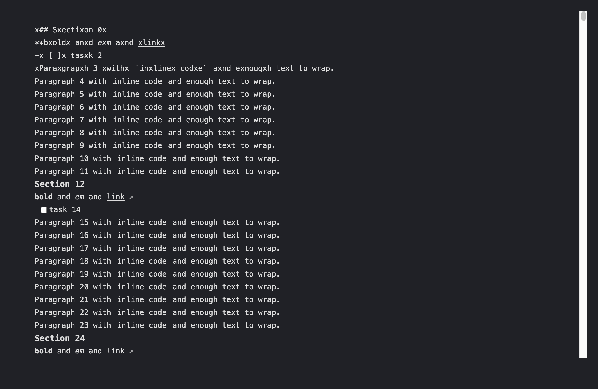

# Inline Preview benchmark

Run from the repository root with the existing development dependencies installed:

```sh
node scripts/benchmark-inline-preview.ts --ref=820bba1 --profile --output=/tmp/preview-before.json --artifacts=/tmp/preview-before
node scripts/benchmark-inline-preview.ts --profile --output=/tmp/preview-after.json --artifacts=/tmp/preview-after
```

The harness bundles the actual editor core, launches a separate Electron process and uses temporary app data. It does not load production settings, IPC, the clipboard or a user vault. Remote image requests use a fixed local image. No additional dependencies are required. `--ref` archives only the specified source revision and resolves both builds against the same installed dependencies.

Each size has one warmup and five measured runs. Each run mounts a fresh editor, waits 300ms, then performs 30 input transactions, 30 cursor changes and 30 scrolls. The fixture repeats headings, emphasis, links, task lists and inline code. Measurements include synchronous `dispatch` time and elapsed time through two animation frames. These are **not physical keypress latency or INP**; two frames impose a roughly 33ms floor. CPU profiling is a separate warm run and does not affect the five measured runs.

The fixture uses the core's default light theme context with a fixed dark background, 1080×650 editor viewport and 14px monospace font. It intentionally excludes the Home screen, React workspace persistence and production CSS. This is a controlled before/after comparison, not a comparison against a different editor or the earlier library spike.

## Results

2026-10-10, Apple M1, macOS arm64, Electron 44.4.5 / Chromium 152 / Node 24.21.0. `before.json` measures main `820bba1342d62c2d146f3c57d9437d69e58bf3f4`; `after.json` measures this change. Each records a SHA-256 of the four changed production modules and all raw samples.

| Lines | Input before → after, median / p95 (ms) | Cursor before → after, median / p95 (ms) | Editing long tasks per run, before → after |
| --- | --- | --- | --- |
| 100 | 33.3 / 34.4 → 33.3 / 34.4 | 33.3 / 34.3 → 33.3 / 34.4 | 0 → 0 |
| 1,000 | 33.4 / 34.4 → 33.3 / 34.3 | 33.3 / 34.4 → 33.3 / 34.3 | 0–1 → 0 |
| 10,000 | 100.6 / 216.7 → 49.9 / 67.1 | 100.1 / 203.9 → 33.3 / 34.4 | 60 → 0–9 |

For 10,000 lines, synchronous input dispatch changed from **87.8 / 203.7ms** to **35.4 / 59.0ms**; cursor dispatch changed from **85.0 / 196.2ms** to **12.5 / 28.1ms**. Median improvement is substantial across the five runs. Smaller documents are at the frame floor; no speedup is claimed there. Their synchronous dispatch costs also vary and are not uniformly lower.

Opening 10,000 lines measured **196.1 / 449.5ms → 195.6 / 302.3ms**. Opening and p95 have substantial variance; no opening speedup is claimed. Full scans for rich widgets, the HFM index and syntax parsing remain. This change does not make editing independent of document size.

CPU sampling attributed about 3,958ms to the old inline decoration builder, including about 1,767ms in its all-line HFM helper. After the change, these paths sampled about 110ms and 10ms respectively; preparing shared document metadata sampled another 339ms. These are **inclusive sampled times from a separate run**, not precise per-call timings, and nested totals overlap. Full `.cpuprofile` files are written to `--artifacts` for inspection in DevTools.

## Correctness and limits

- Existing HFM fixtures retain their original Markdown. All five editor modes pass selection, search and public undo/redo checks.
- Electron checks newly visible content after scrolling, source reveal/hide and pointer-selection freezing across viewport changes. A corresponding full-app regression runs in Electron smoke.
- Focused unit tests cover line-range offsets, image offsets through Unicode/blank lines, rich widget reuse, multi-selection reveal and edits on the same active line. Existing Markdown editor tests cover blocks, tables, images and editor modes.
- The baseline was measured before the extra viewport/freeze checks were added to the harness. The timed document and measurement loop are identical.
- Real Chinese IME and Windows/Linux runtime performance have **not** been manually validated. Synthetic composition or programmatic insertion is not evidence of IME support. No composition handling, editor keymaps, public API or storage format was changed.

`--artifacts` saves a screenshot, video and optional CPU profile. The representative screenshot below shows the editor after the benchmark's edits; inserted `x` characters are intentional test input.


