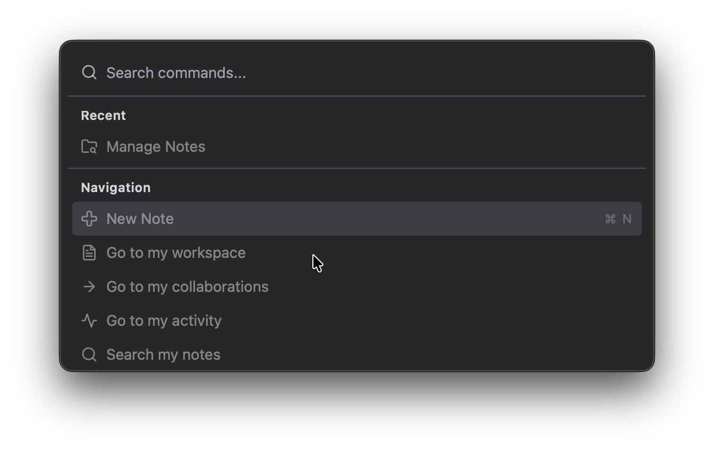
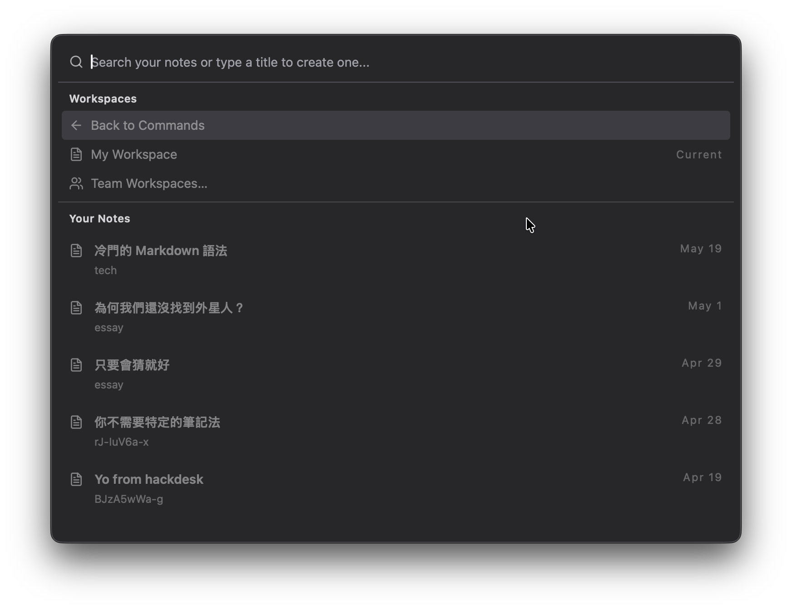
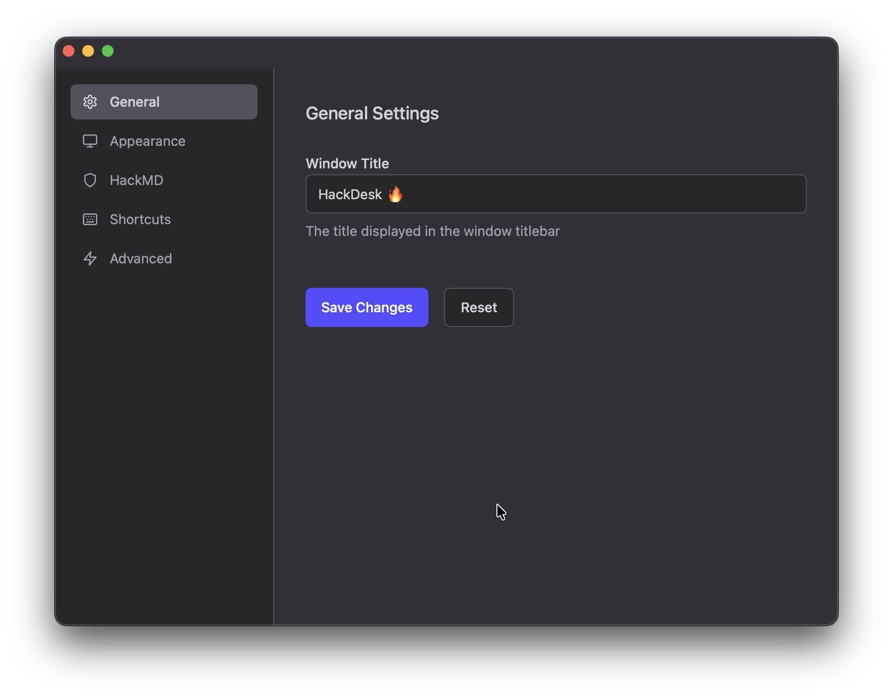
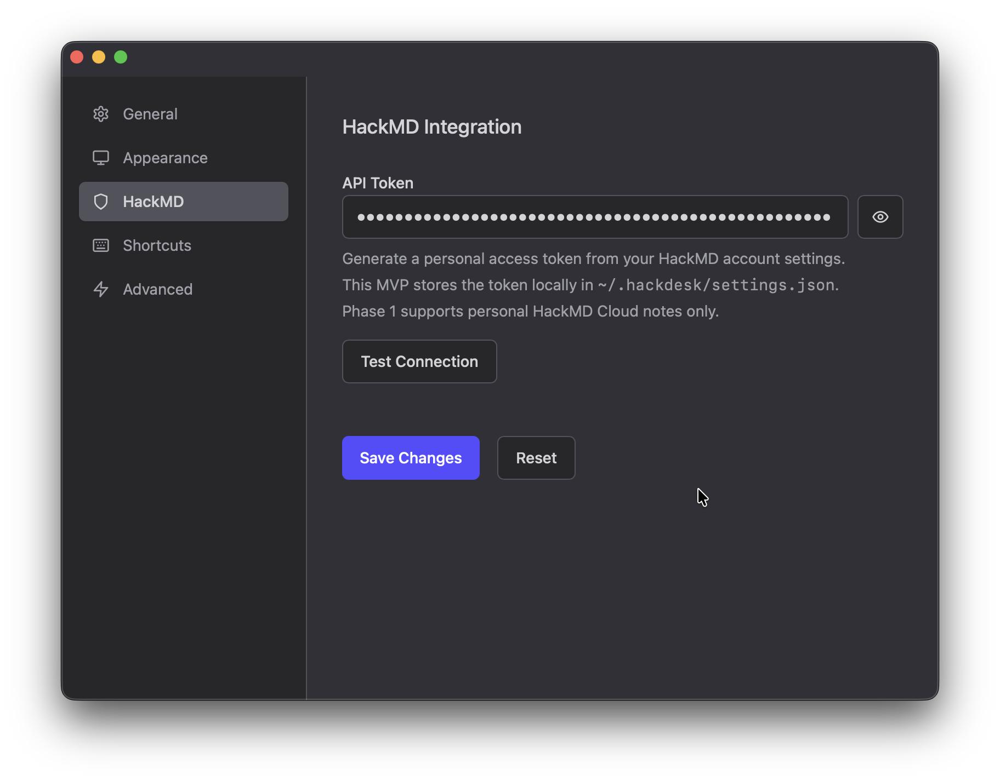

# Features

## Command Palette

`CmdOrCtrl` + `K`

A quick way to execute commands, jump between views, and search your HackMD workspace.

- Open common actions like **New Note**, **Reload**, and **HackDesk Settings**
- Jump to HackMD routes such as search, bookmarks, history, teams, and release notes
- Unlock extra HackMD commands like **Manage Notes** and **Team Navigation** once your API token is configured

### Manage Notes

Inside the command palette, HackDesk can browse your personal notes and team workspaces in one place.

- Search notes instantly and open recent notes without leaving the keyboard
- Create new notes by typing a title directly in the palette
- Switch between **My Workspace** and **Team Workspaces** to work across personal and shared notes

## Custom Settings

`CmdOrCtrl` + `,`

You can change the theme, shortcuts, and local preferences in a dedicated settings window.

### API Integration

Connect HackDesk to your HackMD account with a personal access token.

- Save your API token locally in `~/.hackdesk/settings.json`
- Test the connection before saving to confirm the token works
- Enable HackMD-powered features such as note browsing, note creation, and team workspace access
